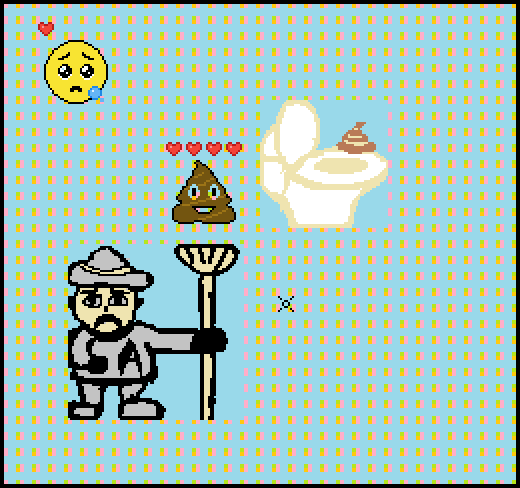

# (TODO: your game's title)

Author: Wenxuan(Neal) Huang, Chunan(Oscar) Huang

Design: (TODO: In two sentences or fewer, describe what is new and interesting about your game.)

Screen Shot:

## How Your Asset Pipeline Works:

Our asset pipeline allows creators to make images with any software, and reads in the created images in png format. 
Developers can directly use the png images. 
Players also run the game with the ported png images. Or, they can create their own images and use them in the game without having to change the program. 

Our assets pipeline relies on two classes:

#####1. SpriteGroup

A SpriteGroup object can be viewed as a group of sprites. Since one sprite has only 8x8 pixels, a SpriteGroup object allows the program to use images of any size.

    Member functions: 

    // draw the SpriteGroup in pos (from left bottom point)
    void draw(int32_t pos_x,int32_t pos_y ); 
    
    // set the spriteGroup obj to be invisible
    void setInVisible(); 
    
    // set the spriteGroup obj to be visible
    void setVisible();   
    
    // return if it is visiable
    bool isVisible();

#####2. SpriteReader

A SpriteReader object reads a png file and constructs a SpriteGroup object from it or set it into the background. It also properly setups everything in PPU466, so that developers can use the images freely without considering the details of PPU466.

    Member functions: 
    
    // link the SpriteReader object with the using PPU
    void setPPUPtr(PPU466 * ppu_ptr);
    
    // read a png file (in "path") with "size", and construct a "spriteGroup" from it
    void getSpriteGroupFromPNG(std::string const & path, glm::uvec2 size, int priority, SpriteGroup & spriteGroup);
    
    // read a 8x8 png and set it as the basic background tile
    void setBackgroundGeneralSprite(std::string const & path);
    
    // read a png imag and set it into background in a specified location
    void setPNGIntoBackground(std::string const & path, glm::uvec2 size, glm::uvec2 location );
    
    // duplicate an existing spriteGroup
    void duplicateSpriteGroup(SpriteGroup const & from, SpriteGroup & to);

#####Examples:

    SpriteGroup bullet, bullet2, bullet3;
    SpriteReader spriteReader;

    // link the using ppu to the sprite reader
	spriteReader.setPPUPtr(&ppu);

	// ---- sprites ---- //
	
	// read a bullet.png into the bullet spriteGroup
	spriteReader.getSpriteGroupFromPNG("../bullet.png", glm::uvec2(8,8), 0, bullet);
	
    // if the spriteGroups are using the same image, we can call duplicateSpriteGroup 
	spriteReader.duplicateSpriteGroup(bullet, bullet2);
	spriteReader.duplicateSpriteGroup(bullet, bullet3);

    // set one bullet invisible
    bullet2.setInVisible();

    // draw SpriteGroup objects
    bullet.draw(10,10);
	bullet2.draw(20,20);
	bullet3.draw(30,30);

	// ---- backgrounds ---- //
	
    // read a 8x8 png and set it the basic background (covers the whole background)
	spriteReader.setBackgroundGeneralSprite("../brick.png");

	// read a png imag and put it into the background in a specified location
	// In this case, we are reading a head.png with size 40x40, and put in into
	//  the background in location [20,20] from left bot, with tile as the unit. 
	//  (note the whole background is 64x06 for PPU466)
	spriteReader.setPNGIntoBackground("../head.png", glm::uvec2(40,40), glm::uvec2(20,20));

##How To Play:

(TODO: describe the controls and (if needed) goals/strategy.)

Sources: (TODO: list a source URL for any assets you did not create yourself. Make sure you have a license for the asset.)

This game was built with [NEST](NEST.md).

